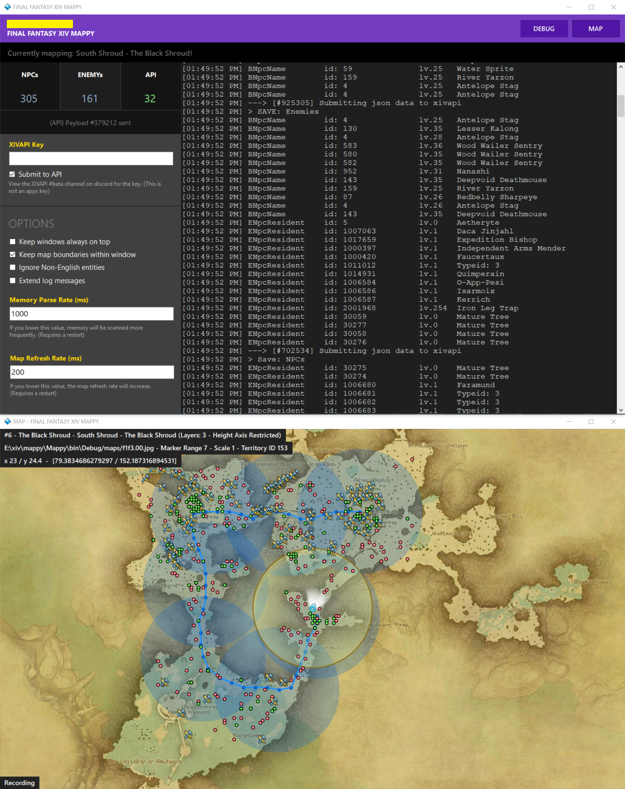

# FFXIV Mappy (beta)

Be nice, I'm a PHP developer.

## Note:

Once built and run once it will download json data from the ffxivapp repositories. There is a custom signature 
modification in this repo, please copy the `signatures-x64.json` to the build output folder overwriting what 
is currently there. For more information on the ffxiv memory module, visit: https://github.com/FFXIVAPP/sharlayan

## What is this?

It is a tool that reads the FFXIV game memory and tracks enemy and npc locations (npc also includes event objects,
gathering locations, spawn objects and aetherytes)

If you need any help, ask Vekien on Discord: https://discord.gg/MFFVHWC

